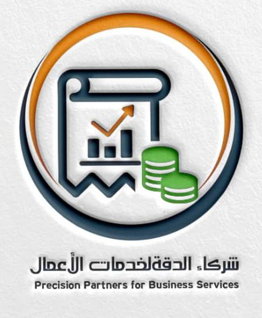

# مكتب المازن للخدمات المحاسبية والاستشارية - MAZT Office

<div align="center">



### مكتب متخصص في الخدمات المحاسبية والضريبية والاستشارية بالمملكة العربية السعودية

[](https://lovable.dev/projects/cb425f6d-6cfb-491f-ab72-e51cdb2f2f04)
[](https://reactjs.org/)
[](https://www.typescriptlang.org/)
[](https://tailwindcss.com/)

</div>

---

## 📋 نظرة عامة / Overview

**العربية:**
مكتب المازن للخدمات المحاسبية والاستشارية هو موقع ويب حديث ومتجاوب يقدم خدمات محاسبية واستشارية شاملة. الموقع مصمم بتقنيات حديثة لتوفير تجربة مستخدم ممتازة وسهولة في التنقل.

**English:**
MAZT Office is a modern, responsive website providing comprehensive accounting and consulting services. Built with cutting-edge technologies to deliver excellent user experience and seamless navigation.

---

## 🚀 الخدمات المقدمة / Services Offered

### 🧮 الخدمات المحاسبية / Accounting Services
- **المحاسبة المالية** - إعداد القوائم المالية والحسابات الختامية
- **محاسبة التكاليف** - تحليل وتتبع تكاليف الإنتاج والعمليات
- **مسك الدفاتر** - تسجيل وتنظيم العمليات المالية اليومية

### 💼 الخدمات الضريبية / Tax Services
- **ضريبة القيمة المضافة** - إعداد وتقديم إقرارات ضريبة القيمة المضافة
- **ضريبة الدخل** - حساب وإعداد إقرارات ضريبة الدخل
- **الضريبة المقتطعة** - إدارة وحساب الضرائب المقتطعة
- **الزكاة** - حساب وإعداد إقرارات الزكاة

### 📊 الخدمات الاستشارية / Consulting Services
- **تأسيس الشركات** - مساعدة في تأسيس وتسجيل الشركات
- **الاستشارات المالية** - تقديم المشورة في الأمور المالية والاستثمارية
- **إعداد دراسات الجدوى** - تحليل وتقييم المشاريع الاستثمارية

---

## 🛠️ التقنيات المستخدمة / Technologies Used

<div align="center">

| Frontend | Backend/Tools | Styling | Development |
|----------|---------------|---------|-------------|
|  |  |  |  |
|  |  |  |  |

</div>

### 📦 المكتبات الرئيسية / Main Libraries

- **React 18.3.1** - مكتبة JavaScript لبناء واجهات المستخدم
- **TypeScript** - لضمان أمان الأكواد وسهولة الصيانة
- **Tailwind CSS** - للتصميم السريع والمتجاوب
- **Shadcn/ui** - مكونات UI حديثة وقابلة للتخصيص
- **React Router DOM** - للتنقل بين الصفحات
- **Lucide React** - أيقونات حديثة وأنيقة
- **Framer Motion** - للحركات والانتقالات السلسة

---

## 🏗️ هيكل المشروع / Project Structure

```
src/
├── components/          # المكونات القابلة لإعادة الاستخدام
│   ├── ui/             # مكونات واجهة المستخدم الأساسية
│   ├── Header.tsx      # رأس الصفحة والتنقل
│   ├── Footer.tsx      # تذييل الصفحة
│   └── ...            # مكونات أخرى
├── pages/              # صفحات الموقع
│   ├── Home.tsx        # الصفحة الرئيسية
│   ├── About.tsx       # صفحة من نحن
│   ├── Services.tsx    # صفحة الخدمات
│   └── ...            # صفحات أخرى
├── constants/          # الثوابت والنصوص
│   └── texts.ts        # جميع النصوص المستخدمة في الموقع
├── hooks/              # React Hooks المخصصة
├── lib/                # المكتبات والأدوات المساعدة
└── ...
```

---

## 🚀 البدء السريع / Quick Start

### متطلبات التشغيل / Prerequisites

- **Node.js** (الإصدار 18 أو أحدث)
- **npm** أو **yarn** أو **bun**

### خطوات التشغيل / Installation Steps

```bash
# 1. استنساخ المشروع / Clone the repository
git clone <YOUR_GIT_URL>

# 2. الانتقال إلى مجلد المشروع / Navigate to project directory
cd <YOUR_PROJECT_NAME>

# 3. تثبيت التبعيات / Install dependencies
npm install

# 4. تشغيل الخادم المحلي / Start development server
npm run dev
```

### الأوامر المتاحة / Available Commands

```bash
# تشغيل الخادم المحلي / Development server
npm run dev

# بناء المشروع للإنتاج / Build for production
npm run build

# معاينة البناء / Preview build
npm run preview

# فحص الكود / Lint code
npm run lint
```

---

## 📱 المزايا / Features

### ✨ تجربة المستخدم / User Experience
- **تصميم متجاوب** - يعمل بسلاسة على جميع الأجهزة
- **واجهة عربية** - مُحسنة للقراءة من اليمين إلى اليسار
- **تحميل سريع** - مُحسن للأداء والسرعة
- **تنقل سهل** - قائمة تنقل واضحة ومنظمة

### 🎨 التصميم / Design
- **ألوان احترافية** - نظام ألوان متناسق ومريح للعين
- **أيقونات حديثة** - استخدام أيقونات Lucide للوضوح
- **خطوط مقروءة** - خطوط محسنة للغة العربية
- **انتقالات سلسة** - حركات مدروسة لتحسين التفاعل

### 🔧 التقنية / Technical
- **أداء عالي** - تحسينات متقدمة للسرعة
- **أمان الكود** - استخدام TypeScript لمنع الأخطاء
- **سهولة الصيانة** - كود منظم وقابل للقراءة
- **قابلية التوسع** - بنية مرنة للإضافات المستقبلية

---

## 📞 معلومات التواصل / Contact Information

<div align="center">

### مكتب المازن للخدمات المحاسبية والاستشارية

📱 **هاتف / Phone:** [+966 53 962 8489](tel:+966539628489)

📧 **بريد إلكتروني / Email:** [mazen1221cool@gmail.com](mailto:mazen1221cool@gmail.com)

📍 **العنوان / Address:** المملكة العربية السعودية

🌐 **الموقع / Website:** [Visit Our Website](https://lovable.dev/projects/cb425f6d-6cfb-491f-ab72-e51cdb2f2f04)

</div>

---

## 🚀 النشر والاستضافة / Deployment & Hosting

### نشر سريع / Quick Deployment
1. افتح [Lovable](https://lovable.dev/projects/cb425f6d-6cfb-491f-ab72-e51cdb2f2f04)
2. اضغط على **Share → Publish**
3. سيتم نشر الموقع تلقائياً

### ربط نطاق مخصص / Custom Domain
- انتقل إلى **Project > Settings > Domains**
- اضغط على **Connect Domain**
- اتبع التعليمات لربط نطاقك

### خيارات الاستضافة / Hosting Options
- **Lovable Hosting** - استضافة سحابية سريعة
- **Vercel** - مناسب للمشاريع React
- **Netlify** - سهل الاستخدام مع CI/CD
- **GitHub Pages** - مجاني للمشاريع العامة

---

## 🤝 المساهمة / Contributing

نرحب بمساهماتكم لتطوير الموقع! يرجى اتباع الخطوات التالية:

### خطوات المساهمة / Contribution Steps

1. **Fork** المشروع
2. إنشاء فرع جديد (`git checkout -b feature/AmazingFeature`)
3. تطبيق التغييرات (`git commit -m 'Add some AmazingFeature'`)
4. رفع الفرع (`git push origin feature/AmazingFeature`)
5. فتح **Pull Request**

### إرشادات الكود / Code Guidelines
- استخدم **TypeScript** لجميع الملفات الجديدة
- اتبع أسلوب الكتابة الموجود في المشروع
- أضف تعليقات واضحة باللغة العربية والإنجليزية
- تأكد من تجاوب التصميم على جميع الأجهزة

---

## 📄 الترخيص / License

هذا المشروع مرخص تحت [رخصة MIT](LICENSE) - راجع ملف الترخيص لمزيد من التفاصيل.

---

## 📚 موارد مفيدة / Useful Resources

### تعلم التقنيات المستخدمة / Learn the Technologies
- [React Documentation](https://reactjs.org/docs) - دليل React الرسمي
- [TypeScript Handbook](https://www.typescriptlang.org/docs) - دليل TypeScript
- [Tailwind CSS](https://tailwindcss.com/docs) - دليل Tailwind CSS
- [Shadcn/ui](https://ui.shadcn.com) - مكونات UI

### أدوات التطوير / Development Tools
- [Lovable Platform](https://lovable.dev) - منصة التطوير المستخدمة
- [VS Code](https://code.visualstudio.com) - محرر الكود المقترح
- [React Developer Tools](https://chrome.google.com/webstore/detail/react-developer-tools/fmkadmapgofadopljbjfkapdkoienihi) - أداة تطوير React

---

<div align="center">

### صُنع بـ ❤️ في المملكة العربية السعودية

**مكتب المازن للخدمات المحاسبية والاستشارية - MAZT Office**

*خدمات محاسبية واستشارية احترافية*

---

[](https://lovable.dev)
[](https://www.saudi.gov.sa)

</div>
